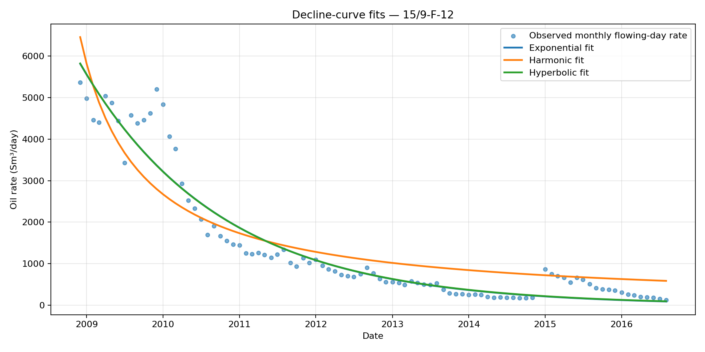
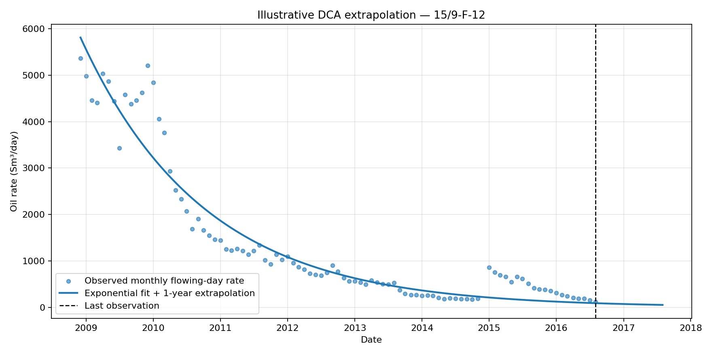
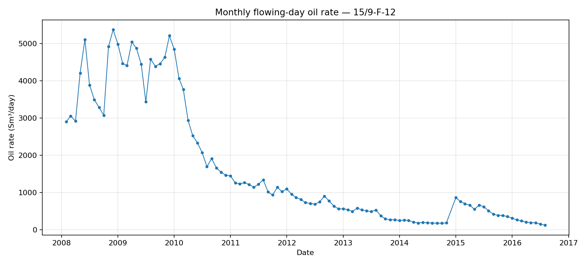

# ResCurve: Decline-Curve Analysis and Forecasting Using Volve Data

ResCurve is a compact decline-curve analysis (DCA) project using open production data from Equinor's Volve field on the Norwegian Continental Shelf. The repository demonstrates production-data preparation, comparison of exponential, harmonic and hyperbolic Arps-style decline functions, and a short illustrative extrapolation for well 15/9-F-12.

## Scope

This is a project-level analytical exercise, not a reserves report or field forecast. It does not estimate OOIP, recovery factor, economic reserves, or a validated economic limit.

The workflow uses the workbook's Monthly Production Data sheet and converts monthly oil volume to an average flowing-day oil rate using reported on-stream hours. This avoids treating a partial month of production as if it were a full-month rate.

## Objective

- Load and quality-check Volve production data
- Compare production histories across available wellbores
- Prepare a post-peak decline window for well 15/9-F-12
- Fit exponential, harmonic and hyperbolic decline functions
- Compare fit quality using RMSE and R²
- Generate a short illustrative extrapolation from the fitted decline trend

## Dataset

**Source:** Equinor Volve Field Dataset  
**Access:** https://www.equinor.com/energy/volve-data-sharing

The source workbook is not included in this repository. To reproduce the notebook, place `Volve production data.xlsx` in a local `data/` folder.

## Current fit result

Using positive-rate monthly observations from the peak-rate month onward:

| Model | RMSE (Sm³/day) | R² |
|---|---:|---:|
| Exponential | 439.90 | 0.9194 |
| Harmonic | 640.08 | 0.8293 |
| Hyperbolic | 440.25 | 0.9192 |

The exponential model is marginally best on these in-sample metrics. The hyperbolic fit converges to the lower bound `b = 0.01`, which indicates behaviour very close to exponential decline for this fitting window.

## Illustrative extrapolation

The notebook extends the selected best-fit decline function by one year beyond the final observation to demonstrate the forecasting workflow.

This extrapolation should not be interpreted as a validated production forecast. The well history contains operational variability and later rate changes that a single deterministic decline curve does not explain.

## Well history

## Important limitations

- Single-well deterministic DCA example
- Model selection is based on in-sample RMSE and R² only
- No train/test validation or uncertainty quantification
- No history matching or reservoir simulation
- No automated regime segmentation or event attribution
- No economics, OOIP, material-balance or recovery-factor calculation
- Operational changes, shut-ins and interventions can invalidate a single decline trend

## Tools

- Python
- pandas / NumPy
- SciPy
- scikit-learn
- matplotlib
- openpyxl
- Jupyter

## Repository contents

- `ResCurve A DCA & Forecasting Project Using Volve Data.ipynb` — reproducible analysis
- `images/` — figures generated by the notebook
- `requirements.txt` — Python dependencies

## Author

**Anuri Nwagbara**  
*Geological Engineer*
