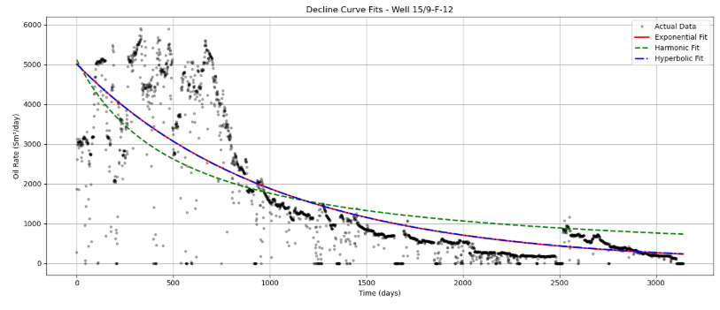
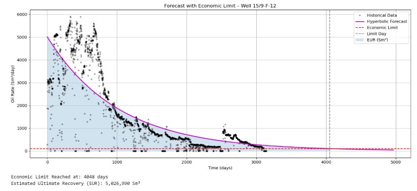
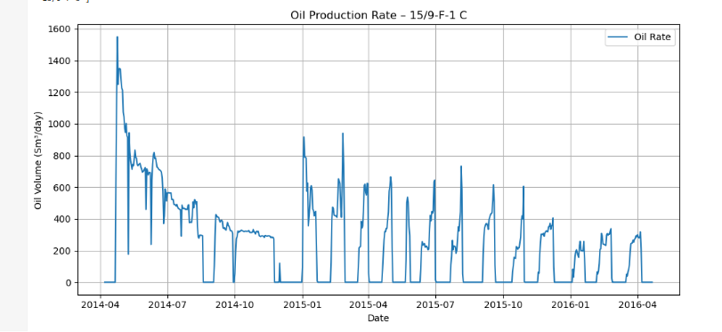
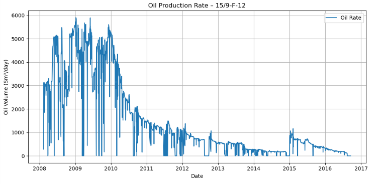
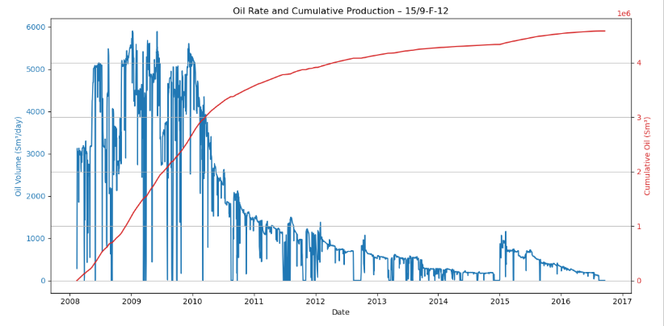

#  ResCurve: A DCA & Forecasting Project Using Volve Data

This project uses production data from the **Volve field** (Norwegian Continental Shelf) to estimate reserves, apply decline curve models, and forecast future production trends.

---

##  Objectives

Using historical production data for multiple wellbores, the goal is to:

- Apply **Decline Curve Analysis (DCA)** models: Exponential, Harmonic, and Hyperbolic
- Estimate **Original Oil in Place (OOIP)** using simplified material balance
- Forecast **future production** using the best-fit decline model
- Generate **clean, visual plots** to support reservoir performance interpretation

---

##  Tools & Libraries

This analysis is implemented in **Python**, using the following packages:

- `openpyxl` – Reading Excel files
- `pandas` – Data cleaning and manipulation
- `matplotlib` – Plotting production trends and model fits
- `numpy` – Numerical computations and model calculations
- `scipy.optimize` – Curve fitting (nonlinear regression)
- `sklearn.metrics` – Model performance evaluation (RMSE, R²)

---

##  Dataset Overview

The dataset includes daily and monthly production volumes for 7 wellbores, including:

- Oil, gas, and water production (Sm³)
- Well names, dates, and operational metadata
- Injection volumes (where available)

---

##  Data Acknowledgment

This project utilizes publicly available production data from the **Volve Field**, provided by **Equinor ASA**.

> **Dataset Source:** Equinor Volve Field Dataset  
> **Accessed via:** [https://www.equinor.com/energy/volve-data-sharing](https://www.equinor.com/energy/volve-data-sharing)

We gratefully acknowledge **Equinor ASA** for sharing this open dataset for research and educational purposes.  
*All rights and credits for the data belong to Equinor ASA.*

---

##  Workflow Summary

```
Load Excel → Inspect structure → Clean and reshape → Plot trends → Fit DCA models → Forecast → Estimate reserves
```

---

##  Key Findings

###  Well Selection – 15/9-F-12

**Well 15/9-F-12** was selected for decline analysis due to:

-  Long Production Life: Over 3000 days of production data  
-  High Cumulative Output: ~4.5 million Sm³  
-  Consistent Production Trends: Minimal interruptions  
-  Clear Decline Pattern: Ideal for decline curve model fitting  

---

###  Decline Curve Fitting

- The **hyperbolic model** provided the best match to historical data:
  - **RMSE = 944.97**, **R² = 0.6769**
  - Selected as the **best-fit model** for forecasting and EUR estimation.



---

###  Forecasting & EUR

- Forecasted oil rate over ~5000 days using the hyperbolic model
- **Economic limit**: 100 Sm³/day  
- **Limit reached**: Day 4048  
- **Estimated Ultimate Recovery (EUR)**: 5,026,990 Sm³



---

###  OOIP Estimation

- Used a simplified material balance approach  
- Assumed Bo = 1.2 reservoir bbl/STB (due to missing PVT)  
- **Estimated OOIP**: 609,865,650 Sm³

---

##  Visual Plots

| Oil Rate – F-1 C | Oil Rate – F-12 | Rate & Cumulative |
|------------------|------------------|--------------------|
|  |  |  |

---

##  License

This project is open for educational and non-commercial use.  
Please acknowledge the original dataset provider (Equinor ASA) in any derivative work.

---

##  Author

**Anuri Nwagbara**  

